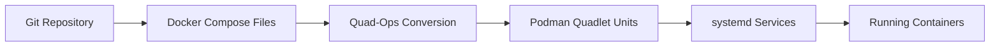

#  quad-ops

## GitOps for Quadlet

A lightweight GitOps framework for podman containers managed by [Quadlet](https://docs.podman.io/en/latest/markdown/podman-systemd.unit.5.html)

Quad-Ops is a tool that helps you manage container deployments using Podman and systemd in a GitOps workflow. It watches Git repositories for standard [Docker Compose](https://compose-spec.io/) files and automatically converts them into unit files that systemd can use to run your containers.

## What Makes Quad-Ops Different

While Quad-Ops uses [Docker Compose](https://compose-spec.io/)  as its configuration format, there are some key differences from traditional [Docker Compose](https://compose-spec.io/)  deployments:

1. **GitOps-Based**: Changes to containers are driven by Git repositories, not manual commands
2. **Systemd Integration**: Containers are managed by systemd instead of a Docker daemon
3. **Podman Backend**: Uses Podman's daemonless container engine instead of Docker
4. **Automated Dependencies**: Service relationships are automatically converted to systemd unit dependencies
5. **Intelligent Restarts**: Only restarts services that have changed and their dependents

## Key Features:
- Monitor multiple Git repositories for container configurations
- Supports standard [Docker Compose](https://compose-spec.io/)  files (services, networks, volumes, secrets)
- Works in both system-wide and user (rootless) modes
- Automates deployment and management of container infrastructure

## How Quad-Ops Works

Quad-Ops bridges the gap between [Docker Compose](https://compose-spec.io/)  and systemd by converting familiar [Docker Compose](https://compose-spec.io/)  configurations into [Podman Quadlet](https://docs.podman.io/en/latest/markdown/podman-systemd.unit.5.html) units:

### The Conversion Process

1. **Git Synchronization** - Monitors repositories for [Docker Compose](https://compose-spec.io/)  file changes
2. **File Processing** - Reads `docker-compose.yml` files and associated environment files
3. **Unit Generation** - Converts services, volumes, and networks to `.container`, `.volume`, and `.network` Quadlet units
4. **systemd Integration** - Loads units into systemd for native service management
5. **Dependency Resolution** - Maps `depends_on` relationships to systemd `After`/`Requires` directives

### Why This Approach?

- **Familiar Configuration** - Use standard [Docker Compose](https://compose-spec.io/)  files you already know
- **systemd Benefits** - Leverage systemd's robust service management, logging, and dependency handling
- **GitOps Workflow** - All changes tracked in Git with rollback capability
- **Podman Integration** - Daemonless, rootless container execution with enhanced security

## Docker Compose Feature Support

Quad-Ops converts [Docker Compose](https://compose-spec.io/)  version 3.x+ configurations into systemd-managed containers through [Podman Quadlet](https://docs.podman.io/en/latest/markdown/podman-systemd.unit.5.html). The following matrix shows which [Docker Compose](https://compose-spec.io/)  features are supported and how they're implemented.

### Feature Support Matrix

This matrix describes [Docker Compose](https://compose-spec.io/)  feature support for **systemd-managed containers** through Quad-Ops conversion:

---
**✅ Native Quadlet Support** - Features that map directly to [Podman Quadlet](https://docs.podman.io/en/latest/markdown/podman-systemd.unit.5.html) directives for optimal systemd integration.

**⚠️ PodmanArgs Implementation** - Features implemented using Quadlet's `PodmanArgs` directive, providing full functionality with some limitations.

**❌ Unsupported** - Docker-specific features incompatible with systemd container management.

---
| Category | Feature | Support Level | Implementation Method |
|----------|---------|---------------|----------------------|
| **Containers** | Image/Command | ✅ Full | Native Quadlet directives |
| | Ports | ✅ Full | Native Quadlet directives |
| | Volumes | ✅ Full | Native Quadlet directives |
| | Environment | ✅ Full | Native Quadlet directives |
| | Restart Policy | ✅ Full | Native Quadlet directives |
| | Dependencies | ✅ Full | systemd After/Requires |
| **Resources** | Memory Limits | ⚠️ Partial | PodmanArgs implementation |
| | CPU Limits | ⚠️ Partial | PodmanArgs implementation |
| | PIDs Limit | ⚠️ Partial | PodmanArgs implementation |
| **Security** | Privileged Mode | ⚠️ Partial | PodmanArgs implementation |
| | Capabilities | ⚠️ Partial | PodmanArgs implementation |
| | SELinux Labels | ⚠️ Partial | PodmanArgs implementation |
| **Networking** | Custom Networks | ✅ Full | Native Quadlet directives |
| | Network Aliases | ✅ Full | Native Quadlet directives |
| | DNS Configuration | ⚠️ Partial | PodmanArgs implementation |
| **Health Checks** | Health Commands | ⚠️ Partial | Native Quadlet directives |
| | Health Dependencies | ❌ None | Not supported in systemd |
| **Build** | Dockerfile Builds | ✅ Full | Quadlet Build units |
| | Build Arguments | ✅ Full | Quadlet Build units |
| | Multi-stage Builds | ✅ Full | Quadlet Build units |

## Compose Extensions

Quad-Ops extends [Docker Compose](https://compose-spec.io/)  with **Podman-specific capabilities**:

- **Environment secrets** mapping for secure credential handling
- **Volume extensions** for advanced mount options
- **Build extensions** for enhanced build configurations

See [Docker Compose Support](docs/container-management/docker-compose-support) for complete configuration examples and [Supported Features](docs/podman-systemd/supported-features) for detailed implementation information.
