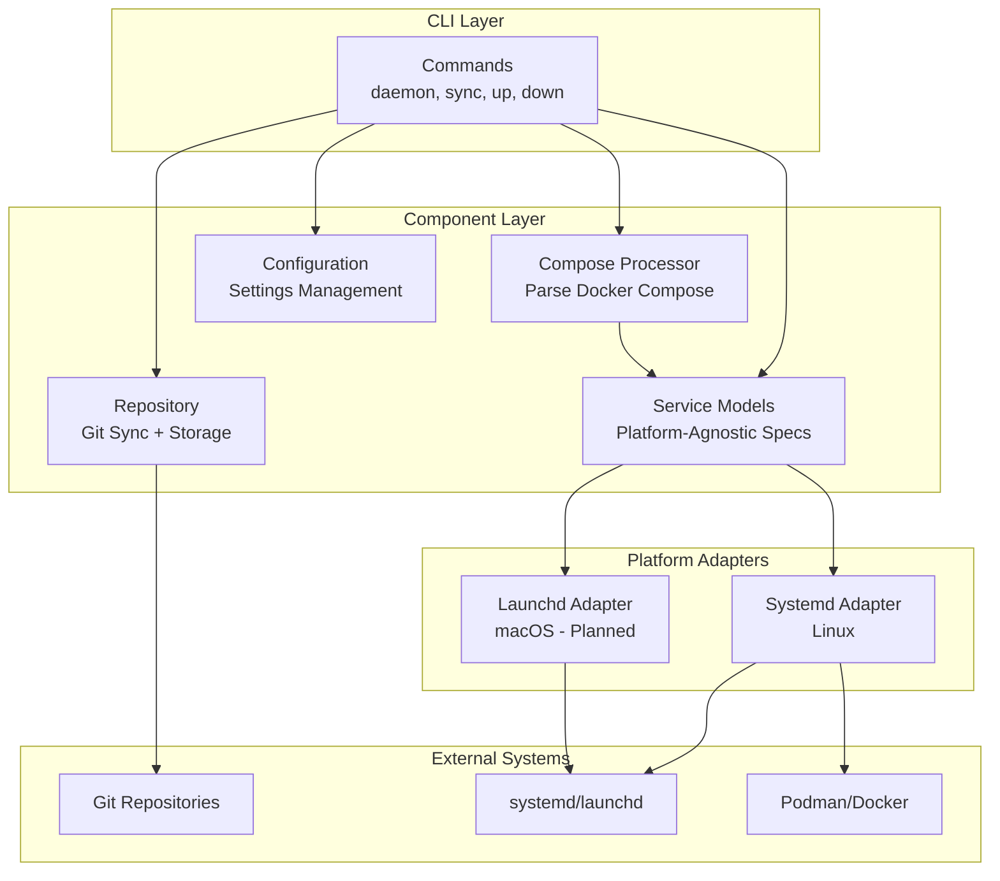
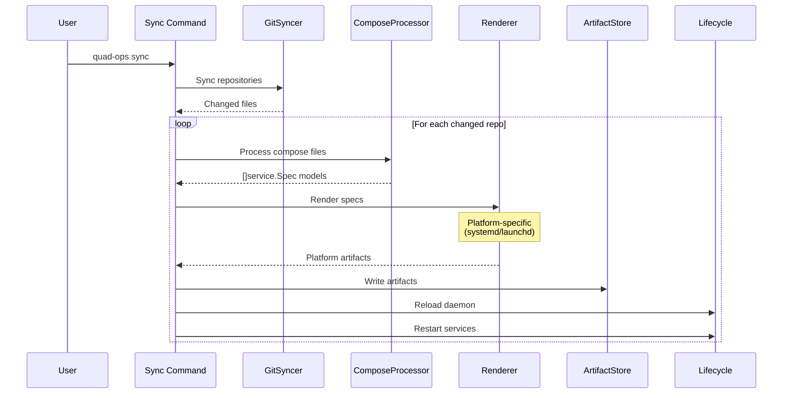

# Architecture

Quad-Ops is designed with cross-platform support at its core, using a domain-driven architecture that separates platform-agnostic service definitions from platform-specific implementations.

## Cross-Platform Design

Quad-Ops supports multiple service management platforms through a clean abstraction layer:

- **Linux**: systemd + Podman Quadlet
- **macOS**: launchd (planned)
- **Future**: Additional platforms can be added without changing core logic

The platform is automatically detected at runtime, and the appropriate backend is used for service management.

## Architecture Overview



## Core Concepts

### 1. Platform-Agnostic Service Models

The heart of quad-ops is the `service.Spec` domain model, which represents container services independent of any platform:

```go
type Spec struct {
    Name         string
    Description  string
    Container    Container
    Volumes      []Volume
    Networks     []Network
    DependsOn    []string
    Annotations  map[string]string
}
```

This model contains all necessary configuration:
- Container image, command, environment
- Volume mounts and configurations
- Network settings
- Service dependencies
- Build specifications

**Key principle**: Domain models ARE the platform-neutral representation. No separate intermediate format needed.

### 2. Compose Processing

The compose processor parses Docker Compose files and converts them directly into platform-agnostic `service.Spec` models:

```
Docker Compose YAML → service.Spec models
```

The processor handles:
- Multi-container definitions
- Environment variable resolution
- Profile selection
- Compose-specific features (build, depends_on, etc.)

**Important**: The compose processor knows nothing about systemd, launchd, or any specific platform. It only produces domain models.

### 3. Platform Adapters

Platform adapters implement two key interfaces:

#### Renderer Interface
Converts domain models to platform-specific artifacts:

```go
type Renderer interface {
    Name() string
    Render(ctx context.Context, specs []service.Spec) ([]Artifact, error)
}
```

**systemd**: Renders `service.Spec` → `.container`, `.volume`, `.network` Quadlet units
**launchd**: Renders `service.Spec` → `.plist` files (planned)

#### Lifecycle Interface
Manages service operations on the target platform:

```go
type Lifecycle interface {
    Name() string
    Reload(ctx context.Context) error
    Start(ctx context.Context, name string) error
    Stop(ctx context.Context, name string) error
    Restart(ctx context.Context, name string) error
    Status(ctx context.Context, name string) (ServiceStatus, error)
}
```

**systemd**: Uses D-Bus API for service management
**launchd**: Uses `launchctl` commands (planned)

### 4. Command Orchestration

Commands orchestrate components directly through dependency injection. For example, the `sync` command:

1. Syncs git repositories (GitSyncer)
2. Processes changed Compose files (ComposeProcessor → `[]service.Spec`)
3. Renders specs to platform artifacts (Renderer)
4. Writes artifacts to disk (ArtifactStore)
5. Reloads service manager (Lifecycle)
6. Restarts changed services (Lifecycle)

## Data Flow

### Sync Workflow



### Platform Selection

Platform detection happens at startup in `cmd/root.go`:

```go
func NewApp() (*App, error) {
    var renderer platform.Renderer
    var lifecycle platform.Lifecycle
    
    switch runtime.GOOS {
    case "linux":
        renderer = systemd.NewRenderer(...)
        lifecycle = systemd.NewLifecycle(...)
    case "darwin":
        renderer = launchd.NewRenderer(...)
        lifecycle = launchd.NewLifecycle(...)
    default:
        return nil, fmt.Errorf("unsupported platform: %s", runtime.GOOS)
    }
    
    return &App{
        PlatformRenderer: renderer,
        PlatformLifecycle: lifecycle,
        // ... other components
    }, nil
}
```

## Platform Implementations

### Linux (systemd + Quadlet)

**Current implementation** - Fully supported

The systemd adapter leverages Podman Quadlet for container management:

1. **Renderer**: Converts `service.Spec` to Quadlet unit files
   - `.container` files for services
   - `.volume` files for named volumes
   - `.network` files for custom networks
   - `.build` files for image builds

2. **Lifecycle**: Uses D-Bus API for systemd operations
   - `systemctl daemon-reload` after changes
   - Service start/stop/restart
   - Status queries and monitoring

3. **Benefits**:
   - Native systemd journal integration
   - Automatic dependency resolution
   - systemd's robust restart policies
   - Socket activation support

### macOS (launchd)

**Planned implementation**

The launchd adapter will provide similar functionality for macOS:

1. **Renderer**: Converts `service.Spec` to launchd `.plist` files
   - Service definition in property list format
   - Environment configuration
   - Dependency management

2. **Lifecycle**: Uses `launchctl` commands
   - Load/unload services
   - Start/stop operations
   - Status monitoring

3. **Container Runtime**: Works with Docker Desktop or Podman
   - Configurable container runtime
   - Same container definitions across platforms

## Adding New Platforms

The architecture makes it straightforward to add new platforms:

1. Create `internal/platform/{platform}/` directory
2. Implement `Renderer` interface (convert `service.Spec` → platform artifacts)
3. Implement `Lifecycle` interface (manage services on that platform)
4. Add platform detection in `cmd/root.go`

**No changes needed** in:
- Compose processing
- Service models
- Repository sync
- Command implementations

This separation ensures quad-ops can expand to support Windows Services, Kubernetes, or other platforms without touching core logic.

## Design Benefits

1. **Cross-Platform**: Easy to support new service managers
2. **Testable**: Clear interfaces enable comprehensive testing
3. **Maintainable**: Platform logic isolated in adapters
4. **Simple**: Domain models eliminate unnecessary abstraction layers
5. **Extensible**: New platforms don't affect existing code
6. **DI-First**: No global state, fully injectable dependencies
7. **Standards-Based**: Docker Compose as universal input format

## Package Organization

```
quad-ops/
├── cmd/                          # CLI + orchestration
│   ├── root.go                   # App DI container + platform selection
│   ├── sync.go                   # Sync command
│   ├── daemon.go                 # Daemon command
│   └── ...
│
├── internal/
│   ├── compose/                  # Docker Compose → service.Spec
│   │   └── processor.go
│   │
│   ├── service/                  # Platform-agnostic models
│   │   ├── models.go             # Spec, Container, Volume, Network
│   │   └── validate.go
│   │
│   ├── platform/                 # Platform abstraction
│   │   ├── interfaces.go         # Renderer, Lifecycle
│   │   │
│   │   ├── systemd/              # Linux implementation
│   │   │   ├── renderer.go       # service.Spec → Quadlet units
│   │   │   └── lifecycle.go      # systemd D-Bus operations
│   │   │
│   │   └── launchd/              # macOS implementation (planned)
│   │       ├── renderer.go       # service.Spec → .plist files
│   │       └── lifecycle.go      # launchctl operations
│   │
│   ├── repository/               # Git sync + artifact storage
│   └── config/                   # Configuration management
```

## Philosophy

**"Make it as simple as possible, but no simpler"**

- Domain models can be platform-agnostic without a separate IR layer
- Commands can orchestrate directly without an app/orchestrator layer
- Platform adapters handle platform-specific rendering
- Less abstraction = easier to understand and maintain
- Pragmatic over theoretical purity
